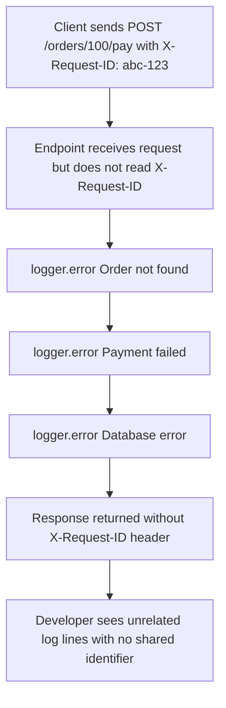
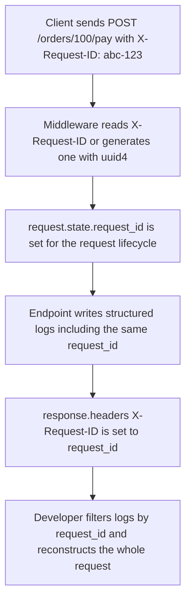

<p align="right">
  <a href="README.md">English</a> |
  <a href="README.ru.md">Русский</a>
</p>

# Missing Request ID Makes Debugging Impossible

## Summary

An endpoint logs errors, but the logs cannot be tied back to a specific HTTP request.

The system has logs, but it does not have correlation. In production, that means debugging turns into guessing.

## Metadata

- ID: `BFL-0005`
- Category: `observability-debugging`
- Secondary categories: `api-http`, `reliability-failure-recovery`
- Level: `beginner`
- Technologies: `python`, `fastapi`, `pytest`
- Failure modes: `missing-observability`
- Patterns: `request-id`, `structured-logging`
- Status: `released`

## Problem

A user sends a request and something fails inside the backend.

The logs contain messages like this:

```text
Order not found
Payment failed
Database error
```

Those messages are not enough when many requests are running at the same time. There is no stable value that connects the HTTP request, internal operation, and error logs.

## Why This Happens in Production

Junior developers often think that having `print()` or `logger.error()` is enough.

In production, the important question is usually not only what failed. It is also which request failed, which user triggered it, and which other logs belong to the same flow.

Without a request ID, logs from different requests mix together.

## Broken Scenario

1. A client sends `POST /orders/100/pay`.
2. The endpoint logs several errors.
3. The response does not include `X-Request-ID`.
4. The log lines do not include `request_id`.
5. A developer cannot connect the response to the log lines.

## Broken Implementation

The broken implementation writes plain log messages:

```python
logger.error("Order not found")
logger.error("Payment failed")
logger.error("Database error")
```

These messages describe events, but they do not include request context.

## Where the Bug Happens

The bug happens at the request boundary.

In `broken/app.py`, the endpoint receives `X-Request-ID`, but the application does not standardize it, return it, or put it into logs.

The backend needs one request-scoped identifier that travels through the request and appears in every relevant log line.

## How to Catch This Bug

Do not only check that an error was logged.

A useful observability test should verify that:

1. the response contains `X-Request-ID`;
2. every relevant log line contains the same request ID;
3. structured fields such as `event`, `user_id`, and `order_id` are present.

This makes the logs searchable and connectable during incident debugging.

## Failing Test

The failing test sends a request with:

```http
X-Request-ID: abc-123
```

Safe behavior is:

- response header `X-Request-ID` is `abc-123`;
- error logs contain the same request ID.

The broken implementation logs plain messages and does not return the request ID, so the test fails.

## Diagnosis

The system fails because logs are not correlated.

A log line without request context can be technically true and still operationally weak. It tells you that something happened, but not which request caused it.

## Fixed Implementation

The fixed implementation adds request ID handling at the middleware layer:

```python
request_id = request.headers.get("X-Request-ID") or str(uuid4())
request.state.request_id = request_id
response.headers["X-Request-ID"] = request_id
```

Middleware is a good place for this because every endpoint gets the same behavior. The endpoint can then write structured logs that include the same `request_id`, plus useful fields such as `event`, `user_id`, and `order_id`.

This case uses JSON strings for structured logs to keep the implementation small. In a real service, you may use a logging formatter, context variables, or a structured logging library, but the core rule is the same: every log from one request must carry the same request ID.

## How to Run

From the repository root:

### Broken Version

```bash
make broken CASE=BFL-0005
```

Expected result: this test is expected to fail because the broken implementation cannot correlate response and logs.

### Fixed Version

```bash
make fixed CASE=BFL-0005
```

Expected result: the tests should pass because the fixed implementation returns and logs the same request ID.

## Files

- `broken/` - implementation with plain logs and no request ID propagation
- `fixed/` - implementation with request ID middleware and structured logs
- `tests/` - tests that verify response/log correlation

## Diagrams

Broken flow:



Fixed flow:



## Production Notes

Request IDs are most useful when they are propagated across boundaries: HTTP request, database logs, worker jobs, external API calls, and error reporting.

If an upstream gateway already sends `X-Request-ID`, the backend should usually preserve it. If no ID exists, the backend should generate one and return it to the client.

Avoid logging sensitive payloads just to make debugging easier. Log stable identifiers and event names instead.

## Trade-Offs

A request ID is simple and cheap, but it only works if every important log line includes it.

Middleware gives consistent request-level behavior, but background jobs need their own propagation strategy.

Structured logs are easier to search and aggregate, but they require a consistent field naming convention.
